# Hexagonal Architecture Design Document

> **Last Updated**: 2025-10-20  
> **Status**: Production-Ready Demo

## Overview

This is a **reference implementation** demonstrating Hexagonal Architecture (Ports & Adapters) using Kotlin and Micronaut. The project showcases clean architecture principles, domain-driven design patterns, and production-ready engineering practices.

**Key Features**:
- ✅ Complete separation of concerns (Domain, Application, Adapter layers)
- ✅ Dependency inversion via Ports & Adapters
- ✅ Result-based error handling (no exception propagation)
- ✅ Domain events and state machine
- ✅ Environment-based adapter switching
- ✅ Comprehensive test coverage

---

## System Architecture

```mermaid
flowchart TB
    subgraph External["🌐 External World"]
        Client[HTTP Client/Browser]
        InventoryService[Inventory Service]
        MQ[Message Queue]
    end

    subgraph Adapter["🔌 Adapter Layer"]
        subgraph InboundAdapter["Inbound Adapters"]
            Controller["OrderController
+ place()
+ health()"]
            Mapper["OrderMapper
DTO ↔ Domain"]
        end

        subgraph OutboundAdapter["Outbound Adapters"]
            RepoImpl["InMemoryOrderRepository
implements OrderRepository"]
            StockImpl["DummyStockChecker
implements StockAvailabilityChecker"]
            EventImpl["LoggingEventPublisher
implements DomainEventPublisher"]
        end
    end

    subgraph Core["⚡ Core Layer"]
        subgraph Port["Port Layer"]
            InPort["PlaceOrderUseCase
Inbound Port"]
            OutPort1["OrderRepository
Outbound Port"]
            OutPort2["StockAvailabilityChecker
Outbound Port"]
            OutPort3["DomainEventPublisher
Outbound Port"]
        end

        subgraph Application["Application Layer"]
            UseCase["OrderPlacementHandler
Implements PlaceOrderUseCase
Result Pipeline"]
        end

        subgraph Domain["Domain Layer"]
            Order["Order Aggregate Root
+ status: OrderStatus
+ domainEvents"]
            OrderItem[OrderItem Value Object]
            Money[Money Value Object]
            OrderStatus["OrderStatus Enum
NEW/CONFIRMED/..."]
            Events["Domain Events
OrderPlacedEvent
OrderStatusChangedEvent"]
            OrderError["OrderError
sealed class"]
        end
    end

    Client --> Controller
    Controller --> Mapper
    Mapper --> InPort
    InPort -.implements.-> UseCase
    UseCase --> Order
    UseCase --> OutPort1
    UseCase --> OutPort2
    UseCase --> OutPort3
    OutPort1 -.implements.-> RepoImpl
    OutPort2 -.implements.-> StockImpl
    OutPort3 -.implements.-> EventImpl
    Order --> OrderItem
    Order --> Money
    Order --> OrderStatus
    Order --> Events
    UseCase --> OrderError

    RepoImpl --> InventoryService
    EventImpl --> MQ
```



---

## Port and Adapter Mapping

| Port Interface | Responsibility | Implementation (Adapter) | Environment |
|---|---|---|---|
| **Inbound Ports** |
| `PlaceOrderUseCase` | Place order use case | `OrderPlacementHandler` | All |
| **Outbound Ports** |
| `OrderRepository` | Order persistence | `InMemoryOrderRepository` | dev/test |
|  |  | `PostgresOrderRepository` ⚡ | prod |
| `StockAvailabilityChecker` | Stock checking | `DummyStockChecker` | dev/test |
|  |  | `RestStockChecker` ⚡ | prod |
| `DomainEventPublisher` | Event publishing | `LoggingEventPublisher` | dev/test |
|  |  | `KafkaEventPublisher` ⚡ | prod |

> ⚡ Indicates optional production-level implementation (requires additional configuration)

---

## Order Placement Flow


---

## Core Domain Model

### Order Aggregate Root
```kotlin
class Order private constructor(
    val id: OrderId,
    val items: List<OrderItem>,
    val status: OrderStatus
) {
    companion object {
        fun create(items: List<OrderItem>): Order
    }
    
    fun transitionTo(newStatus: OrderStatus): Result<Order>
    fun pullDomainEvents(): List<DomainEvent>
    fun total(): Money
}
```

### Order State Machine
```
NEW → CONFIRMED → PROCESSING → SHIPPED → DELIVERED
      ↓
   CANCELLED (from NEW/CONFIRMED only)
```

### Value Objects
- **Money**: Immutable, 2-decimal precision, arithmetic operations
- **OrderItem**: Product ID, quantity, price validation
- **OrderId/CustomerId**: Type-safe identifiers

### Domain Events
- `OrderPlacedEvent`: Triggered when order is created
- `OrderStatusChangedEvent`: Triggered on state transitions

### Error Model
```kotlin
sealed class OrderError(message: String, code: String, cause: Throwable?) : Throwable {
    class InvalidOrder(message: String, cause: Throwable? = null) 
        : OrderError(message, "INVALID_ORDER", cause)
    
    class InsufficientStock(message: String, val unavailableItems: List<String> = emptyList()) 
        : OrderError(message, "INSUFFICIENT_STOCK", null)
    
    class InvalidState(message: String, val currentState: String, val targetState: String) 
        : OrderError(message, "INVALID_STATE", null)
    
    class DomainViolation(message: String, cause: Throwable? = null) 
        : OrderError(message, "DOMAIN_VIOLATION", cause)
    
    class OrderPlacementFailed(message: String, cause: Throwable? = null) 
        : OrderError(message, "ORDER_PLACEMENT_FAILED", cause)
}
```

---

## Test Coverage

```
src/test/kotlin/
├── core/
│   ├── domain/
│   │   ├── OrderTest.kt                     ✅ Aggregate root behavior
│   │   ├── OrderStateTransitionTest.kt      ✅ State machine validation
│   │   ├── OrderItemTest.kt                 ✅ Value object validation
│   │   └── MoneyTest.kt                     ✅ Money calculations
│   ├── application/
│   │   └── OrderPlacementHandlerTest.kt     ✅ Use case orchestration
│   └── fakes/
│       ├── FakeOrderRepository.kt           ✅ Test doubles
│       ├── FakeStockChecker.kt              ✅ Test doubles
│       └── FakeDomainEventPublisher.kt      ✅ Test doubles
├── adapter/
│   └── incoming/http/mapper/
│       └── OrderMapperTest.kt               ✅ DTO ↔ Domain mapping
└── e2e/
    └── OrderE2ETest.kt                      ✅ Full HTTP flow
```

**Coverage Goals**: Domain 100%, Application 90%+, Adapters 80%+

---

## Architecture Decision Records (ADR)

### ADR-001: Result Type for Error Handling
**Status**: ✅ Adopted  
**Context**: Need explicit, type-safe error handling without exceptions  
**Decision**: Use Kotlin `Result<T>` for all port methods and use case returns  
**Consequences**:
- ✅ More explicit error contracts
- ✅ Better type safety and testability
- ✅ Avoid exception stack overhead
- ❌ More verbose than throwing exceptions

### ADR-002: Domain Events in Aggregates
**Status**: ✅ Adopted  
**Context**: Need to communicate domain changes to other bounded contexts  
**Decision**: Aggregates manage their own events, publish after persistence  
**Consequences**:
- ✅ Events stay consistent with state changes
- ✅ Unified publishing after transaction success
- ✅ Pull-based event collection prevents duplicates
- ❌ Requires event cleanup mechanism

### ADR-003: Environment-Based Adapter Switching
**Status**: ✅ Adopted  
**Context**: Need different implementations for dev/test/prod  
**Decision**: Use Micronaut's `@Requires(env = [...])` for adapter selection  
**Consequences**:
- ✅ Zero-config switching between environments
- ✅ Fast startup with in-memory fakes in dev/test
- ✅ Production adapters activated automatically
- ❌ Must ensure profile is set correctly in deployment

---

## Extension Guide

### Adding a New Use Case

```kotlin
// 1. Define Inbound Port (core/port/incoming/)
interface CancelOrderUseCase {
    fun execute(command: CancelOrderCommand): Result<Unit>
}

// 2. Implement Handler (core/application/usecase/)
@Singleton
class CancelOrderHandler(
    private val repository: OrderRepository,
    private val eventPublisher: DomainEventPublisher
) : CancelOrderUseCase {
    override fun execute(command: CancelOrderCommand): Result<Unit> {
        return repository.findById(command.orderId)
            .mapCatching { order ->
                order.cancel()
            }
            .flatMap { updatedOrder ->
                repository.save(updatedOrder)
                    .onSuccess { eventPublisher.publishAll(updatedOrder.pullDomainEvents()) }
            }
    }
}

// 3. Add Controller Endpoint (adapter/incoming/http/)
@Delete("/{orderId}")
fun cancel(@PathVariable orderId: String): HttpResponse<ApiResponse<Unit>> {
    // Map and delegate to use case
}
```

### Adding a New Order Status

```kotlin
// 1. Update OrderStatus Enum (core/domain/OrderStatus.kt)
enum class OrderStatus {
    NEW, CONFIRMED, PROCESSING, SHIPPED, DELIVERED, CANCELLED, RETURNED  // ← Add RETURNED
    
    fun canTransitionTo(target: OrderStatus): Boolean {
        return when (this) {
            NEW -> target in setOf(CONFIRMED, CANCELLED)
            CONFIRMED -> target in setOf(PROCESSING, CANCELLED)
            PROCESSING -> target in setOf(SHIPPED, CANCELLED)
            SHIPPED -> target in setOf(DELIVERED)
            DELIVERED -> target == RETURNED  // ← Add new transition rule
            CANCELLED -> false
            RETURNED -> false
        }
    }
}

// 2. Add Domain Event (core/domain/event/)
data class OrderReturnedEvent(
    val orderId: OrderId,
    val returnReason: String,
    override val eventId: String = UUID.randomUUID().toString(),
    override val occurredAt: Instant = Instant.now()
) : BaseDomainEvent(eventId, occurredAt) {
    override val eventType: String = "OrderReturned"
}

// 3. Update Order Aggregate (add method to Order class)
fun returnOrder(reason: String): Result<Order> {
    // transitionTo already returns Result<Order> and raises OrderStatusChangedEvent
    return transitionTo(OrderStatus.RETURNED)
}
```

### Switching to Real Database

```kotlin
// 1. Add Dependencies (build.gradle.kts)
implementation("io.micronaut.sql:micronaut-jdbc-hikari")
implementation("org.postgresql:postgresql")

// 2. Implement Adapter (adapter/outgoing/persistence/)
@Singleton
@Requires(env = ["prod"])
class PostgresOrderRepository(
    private val dataSource: DataSource
) : OrderRepository {
    
    override fun save(order: Order): Result<OrderId> = runCatching {
        dataSource.connection.use { conn ->
            val stmt = conn.prepareStatement(
                "INSERT INTO orders (id, total_amount, status) VALUES (?, ?, ?)"
            )
            stmt.setString(1, order.id.value)
            stmt.setBigDecimal(2, order.total().amount)
            stmt.setString(3, order.status.name)
            stmt.executeUpdate()
            order.id
        }
    }.fold(
        onSuccess = { Result.success(it) },
        onFailure = { Result.failure(OrderPlacementFailed("Database error: ${it.message}", it)) }
    )
    
    override fun findById(orderId: OrderId): Result<Order> {
        // Query and map to domain model
    }
}

// 3. Configuration (application-prod.yml)
datasources:
  default:
    url: jdbc:postgresql://localhost:5432/orders
    username: ${DB_USER}
    password: ${DB_PASSWORD}
    driver-class-name: org.postgresql.Driver
```

---

## Design Patterns Used

| Pattern | Location | Purpose |
|---|---|---|
| **Hexagonal Architecture** | Overall structure | Dependency inversion, testability |
| **Repository Pattern** | `OrderRepository` | Abstract persistence concerns |
| **Factory Method** | `Order.create()` | Controlled object creation |
| **Value Object** | `Money`, `OrderItem` | Immutability, self-validation |
| **Aggregate Root** | `Order` | Consistency boundary enforcement |
| **Domain Event** | `OrderPlacedEvent` | Decouple system communication |
| **Strategy Pattern** | Adapter switching | Runtime behavior replacement |
| **State Machine** | `OrderStatus` | State transition control |
| **Result Monad** | Error handling | Functional error management |

---

## Best Practices

### ✅ DO (Recommended)

```kotlin
// ✅ Domain objects encapsulate invariants
data class Order private constructor(...) {
    init {
        require(items.isNotEmpty()) { "Order must have at least one item" }
        require(totalAmount > Money.ZERO) { "Order total must be positive" }
    }
}

// ✅ Ports return Result for explicit error handling
interface OrderRepository {
    fun save(order: Order): Result<OrderId>
}

// ✅ Use case orchestrates, domain logic stays in domain
@Transactional
fun placeOrder(command: PlaceOrderCommand): Result<OrderId> {
    return stockChecker.checkAndReserve(command.items)
        .flatMap { Order.create(command.items) }
        .flatMap { order -> repository.save(order) }
        .onSuccess { eventPublisher.publishAll(order.pullDomainEvents()) }
}

// ✅ Value objects are immutable and self-validating
data class Money(val amount: BigDecimal, val currency: String = "USD") {
    init {
        require(amount.scale() <= 2) { "Amount must have at most 2 decimal places" }
    }
}
```

### ❌ DON'T (Anti-patterns)

```kotlin
// ❌ Don't expose mutable state
data class Order(var items: MutableList<OrderItem>)  // Breaks encapsulation

// ❌ Don't throw exceptions from ports
interface OrderRepository {
    @Throws(SQLException::class)
    fun save(order: Order): Order  // Forces exception handling
}

// ❌ Don't call external dependencies from domain
class Order {
    fun place() {
        httpClient.post("/notify")  // Violates dependency rule
    }
}

// ❌ Don't put business logic in adapters
@Controller
class OrderController {
    @Post("/orders")
    fun create(@Body dto: OrderDto): HttpResponse<*> {
        if (dto.items.isEmpty()) return HttpResponse.badRequest()  // Logic belongs in domain!
        // ...
    }
}
```

---

## Running the Application

### Development Mode
```bash
./gradlew run
# Uses in-memory adapters, fast startup
```

### Production Mode
```bash
MICRONAUT_ENVIRONMENTS=prod ./gradlew run
# Activates production adapters (requires external services)
```

### Testing
```bash
./gradlew test           # Run all tests
./gradlew detekt         # Static code analysis
./gradlew ktlintCheck    # Code style check
```

---

## Project Structure

```
src/main/kotlin/me/windy/demo/order/
├── core/
│   ├── domain/
│   │   ├── model/           # Aggregates, entities, value objects
│   │   ├── event/           # Domain events
│   │   └── error/           # Error types
│   ├── application/
│   │   └── usecase/         # Use case handlers
│   └── port/
│       ├── incoming/        # Inbound ports (use case interfaces)
│       └── outgoing/        # Outbound ports (repository, service interfaces)
└── adapter/
    ├── incoming/
    │   ├── http/            # REST controllers
    │   └── cli/             # CLI interface
    └── outgoing/
        ├── persistence/     # Repository implementations
        ├── stock/           # Stock checking adapters
        └── event/           # Event publisher adapters
```

---

## Related Documentation

- [Error Handling Mapping](./ErrorMapping.md) - HTTP status codes and error type mappings
- [Architecture Comparison](./docs/ARCHITECTURE_COMPARISON.md) - Layered vs Hexagonal comparison
- [Demo Script](./DEMO_SCRIPT.md) - Step-by-step demonstration guide
- [Changelog](./CHANGELOG.md) - Version history and improvements

---

## References

- [Hexagonal Architecture (Alistair Cockburn)](https://alistair.cockburn.us/hexagonal-architecture/)
- [Clean Architecture (Uncle Bob)](https://blog.cleancoder.com/uncle-bob/2012/08/13/the-clean-architecture.html)
- [Domain-Driven Design (Eric Evans)](https://www.domainlanguage.com/ddd/)
- [Micronaut Framework](https://micronaut.io/)
- [Kotlin Result Type](https://kotlinlang.org/api/latest/jvm/stdlib/kotlin/-result/)

---

**This is a learning-focused demo project showcasing production-ready architecture patterns.**
